# SHPD — Smart Healthy Posture Detector

Sistema de monitoreo postural en tiempo real para Raspberry Pi 3: detecta con visión por computadora cuándo una persona sentada adopta una mala postura y avisa por Telegram antes de que se vuelva un hábito.


## Índice

- [Descripción](#descripción)
- [Demo](#demo)
- [Características principales](#características-principales)
- [Stack tecnológico](#stack-tecnológico)
- [Arquitectura](#arquitectura)
- [Estructura del proyecto](#estructura-del-proyecto)
- [Instalación y uso](#instalación-y-uso)
  - [Modo Raspberry Pi (dispositivo real)](#modo-raspberry-pi-dispositivo-real)
  - [Modo PC (desarrollo y testing)](#modo-pc-desarrollo-y-testing)
- [Variables de entorno](#variables-de-entorno)
- [API](#api)
- [Decisiones técnicas](#decisiones-técnicas)
- [Autor y contacto](#autor-y-contacto)

## Descripción

SHPD monitorea la postura de una persona sentada frente a una cámara y avisa cuando detecta que lleva demasiado tiempo en mala posición. El caso de uso central es el trabajo en escritorio: sesiones largas frente a una pantalla donde la mala postura se instala sin que la persona lo note, con impacto directo en dolores cervicales y lumbares.

El sistema corre sobre una **Raspberry Pi 3** con una cámara conectada. Un pipeline de visión por computadora en dos etapas hace el trabajo pesado: **MediaPipe Pose** calcula en cada frame los ángulos de cuello y torso (geometría pura, sin costo de red, corre a la velocidad de la cámara), y cuando detecta que la mala postura se sostiene más de un umbral configurable, dispara una segunda clasificación más fina con **GPT-4o-mini (visión)** de OpenAI, que identifica cuál de 12 posturas problemáticas específicas está ocurriendo (tronco flexionado, hombros elevados, mentón apoyado en la mano, etc.). Esta combinación evita pagar una llamada a un LLM en cada frame y reserva la clasificación cara para el momento en que realmente aporta información.

Cada paciente interactúa con el sistema exclusivamente a través de un **bot de Telegram**: ahí se registra, configura la duración de sus sesiones y el umbral de alerta, y recibe las notificaciones de mala postura y el reporte al finalizar cada sesión. Un **especialista** (kinesiólogo, médico, quien haga seguimiento) se registra por el mismo bot y recibe ese reporte final con el resumen de la sesión. Un **frontend web** complementa el flujo con video en vivo, métricas en tiempo real y el proceso de calibración inicial del dispositivo.

## Demo

### Dashboard web

Vista completa de una sesión activa: video en vivo con el esqueleto de MediaPipe dibujado, la postura detectada, métricas de correcta/incorrecta y el historial de la sesión.

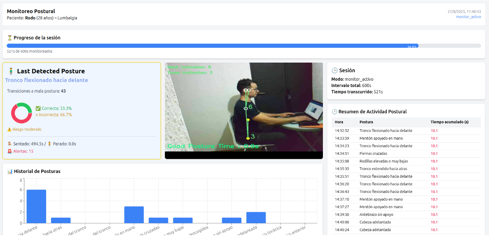

<details>
<summary>Más capturas del dashboard</summary>

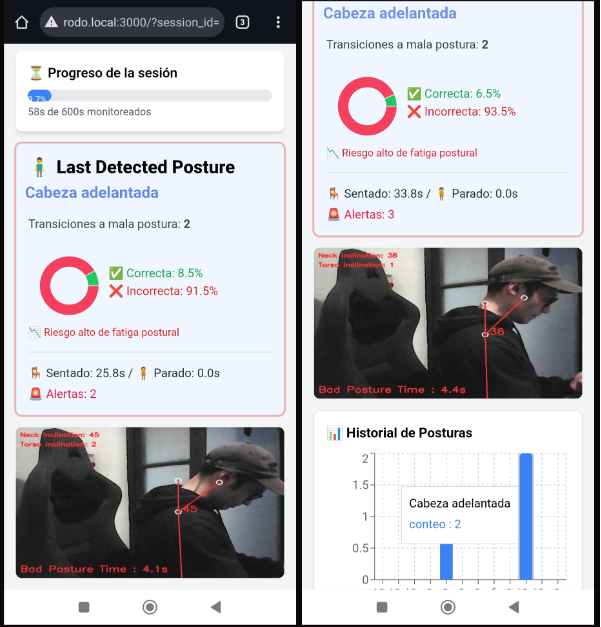

</details>

### Calibración del dispositivo

Antes de la primera sesión, cada dispositivo pasa por una calibración guiada con progreso en vivo.

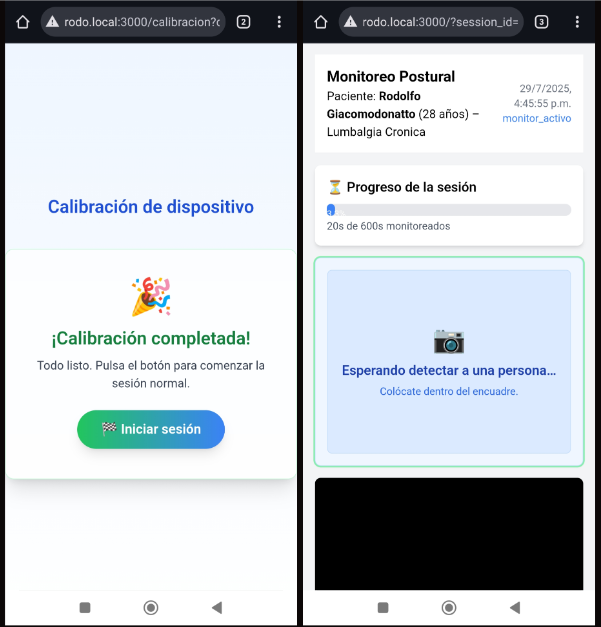

### Bot de Telegram

Toda la interacción del paciente —registro, configuración de sesión, ajuste de umbral de alerta, alertas en vivo y reporte final— pasa por el bot.

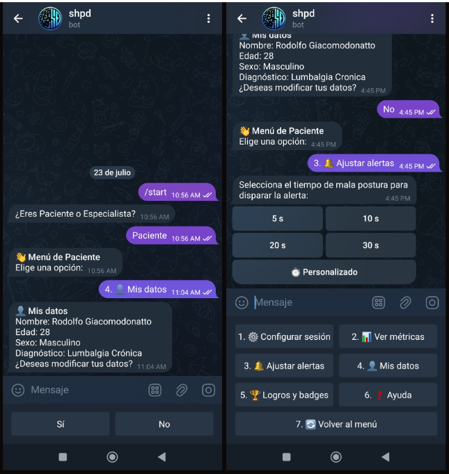

<details>
<summary>Más capturas del bot</summary>

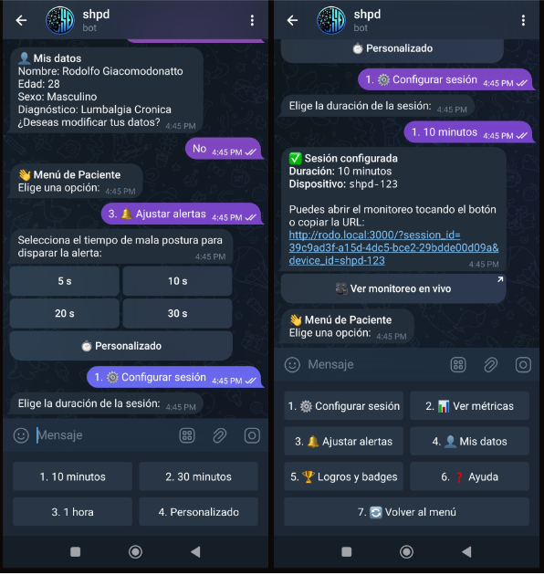
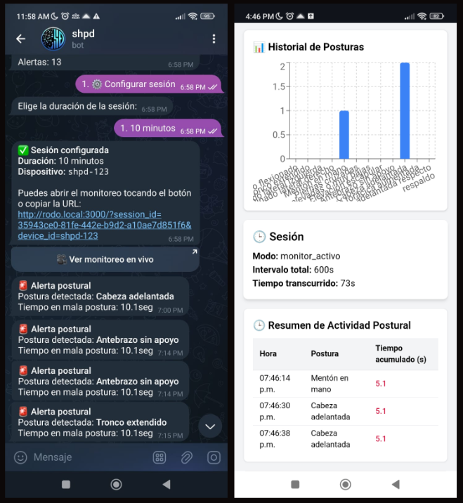
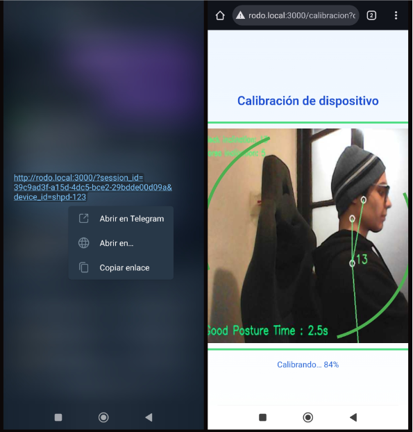
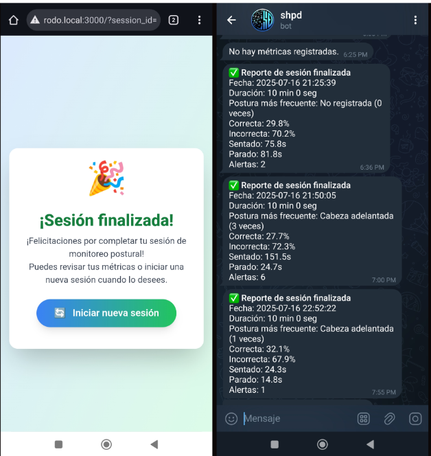

</details>

### Aprovisionamiento inicial (modo Access Point)

Primer arranque de la Raspberry Pi, sin monitor ni teclado: hotspot WiFi propio y formulario de configuración.

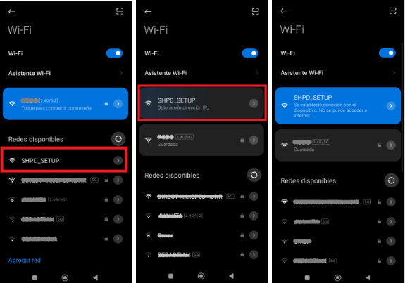
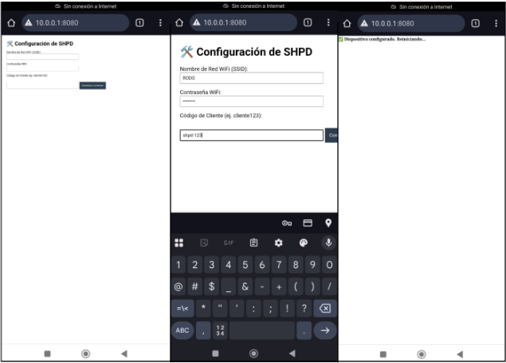

### Dispositivo

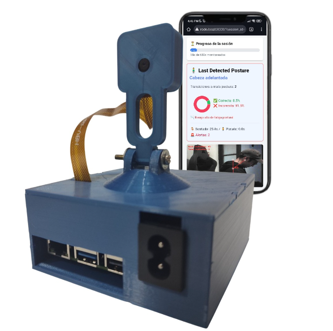

## Características principales

- 🦴 **Detección de postura en tiempo real** vía MediaPipe Pose (ángulos de cuello y torso), corriendo directamente en la Raspberry Pi.
- 🧠 **Clasificación fina con IA** de 12 posturas problemáticas específicas usando GPT-4o-mini (visión), disparada solo cuando hace falta.
- 🎯 **Calibración guiada por dispositivo**: cada Raspberry Pi/cámara pasa por una calibración inicial antes de empezar a medir sesiones reales.
- 🤖 **Bot de Telegram** como interfaz principal para pacientes (registro, configuración de sesión, ajuste de umbral de alerta) y especialistas (registro, recepción de reportes).
- 🔔 **Alertas configurables**: umbral de tiempo en mala postura ajustable por paciente (5/10/20/30 s o personalizado) antes de disparar la clasificación y la notificación.
- 📊 **Dashboard web en vivo**: video procesado en tiempo real, métricas de sesión, historial de posturas y progreso, servido por una SPA de React.
- 📶 **Aprovisionamiento sin pantalla**: la Raspberry Pi arranca su propio hotspot WiFi (`SHPD_SETUP`) para configurarse la primera vez, sin necesitar monitor ni teclado conectados.
- 📄 **Reporte de cierre de sesión** enviado automáticamente al especialista con duración, porcentaje de postura correcta/incorrecta y la postura más frecuente detectada.

## Stack tecnológico

| Tecnología | Versión | Uso |
|---|---|---|
| Python | 3.12 | Backend, bot y scripts de dispositivo |
| FastAPI | — | API REST + WebSockets del backend |
| Uvicorn | — | Servidor ASGI |
| MediaPipe | **0.10.14** (fijada) | Detección de landmarks corporales (pose) |
| OpenCV | — | Captura/codificación de frames de video |
| OpenAI API | `gpt-4o-mini` | Clasificación de las 12 posturas específicas |
| python-telegram-bot | ≥20.0 | Bot de Telegram (registro, menús, alertas) |
| SQLAlchemy + psycopg2 | — | ORM y driver de PostgreSQL |
| PostgreSQL | — | Persistencia: pacientes, especialistas, sesiones, métricas |
| Redis | — | Estado en tiempo real: contadores de frames, calibración, colas de alerta |
| React | 19 | Frontend SPA |
| TypeScript | — | Tipado del frontend |
| TailwindCSS | — | Estilos del frontend |
| Recharts | — | Gráficos de métricas |
| react-router-dom | 6 | Ruteo (vista normal vs. calibración) |
| Picamera2 | — | Captura de cámara en la Raspberry Pi |
| hostapd + dnsmasq | — | Hotspot WiFi de aprovisionamiento inicial |
| systemd | — | Arranque automático en la Raspberry Pi |

## Arquitectura

### Vista general

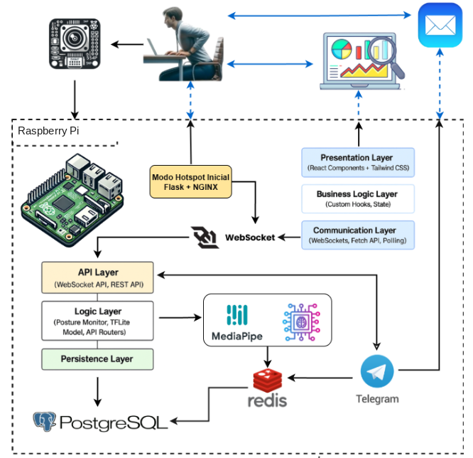

### Flujo de datos

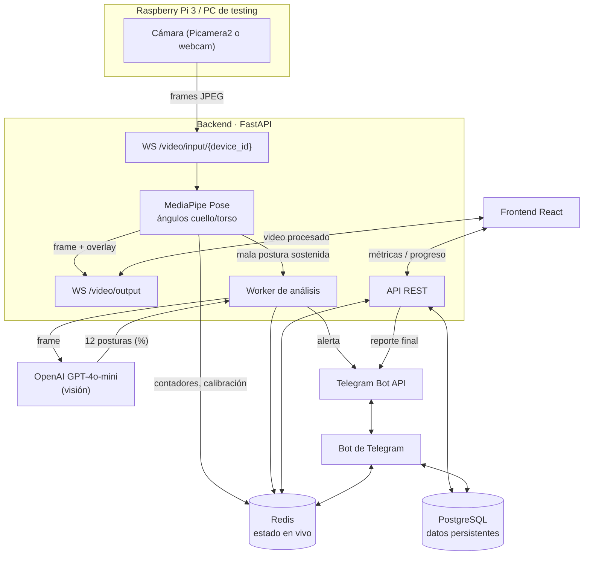

### Flujo de uso (paciente)

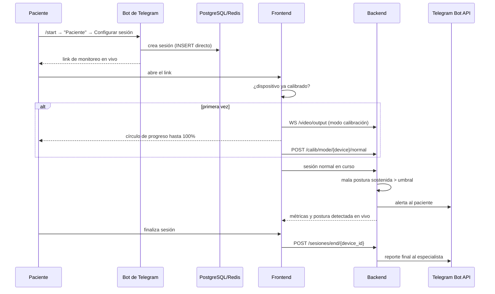

## Estructura del proyecto

```
shpd-all/
├── backend/                # API FastAPI + WebSocket + pipeline de postura
│   ├── main.py              # Entry point: WebSockets de video, worker de OpenAI, montaje de routers
│   ├── posture_monitor.py   # Cálculo de ángulos con MediaPipe, lógica de alerta/calibración
│   ├── config/
│   │   └── posture_config.json  # Umbrales de ángulo cuello/torso
│   └── api/
│       ├── database.py      # Engine y sesión de SQLAlchemy
│       ├── models.py        # Modelos ORM (Paciente, Sesion, MetricaPostural, PosturaCount)
│       ├── schemas.py       # Esquemas Pydantic de entrada/salida
│       └── routers/         # Un router por recurso (sesiones, pacientes, métricas, etc.)
│
├── bot/                     # Bot de Telegram (registro, menús, alertas)
│   └── app/bot.py
│
├── frontend/                 # SPA de React (video en vivo, calibración, métricas)
│   └── src/
│       ├── AppRouter.tsx     # Decide vista normal vs. calibración según el dispositivo
│       ├── App.tsx           # Vista de sesión activa
│       ├── pages/            # Página de calibración
│       └── components/       # Video, métricas, gráficos, timeline
│
├── modo-ap/                  # Raspberry Pi: modo Access Point de aprovisionamiento inicial
├── modo-app/                 # Raspberry Pi: arranque automático de backend/bot/frontend (systemd)
├── modo-pc/                  # PC: scripts equivalentes para desarrollo y testing local
│
├── docs/                      # Capturas del README y referencia extendida de la API
│   └── API.md
│
├── .env.example               # Variables de entorno necesarias, sin valores reales
├── requirements-pc.txt        # Dependencias Python fijadas, probadas end-to-end en PC
└── LICENSE
```

## Instalación y uso

SHPD corre en **dos contextos distintos**, con requisitos y pasos de arranque diferentes:

- **Modo Raspberry Pi**: el despliegue real, en el hardware final (Raspberry Pi 3 + cámara). Usa `modo-ap/` para el aprovisionamiento WiFi inicial y `modo-app/` para el arranque automático de los tres servicios vía `systemd`.
- **Modo PC**: para desarrollar y probar el sistema sin tener el hardware a mano, usando la webcam de una notebook/PC común. Usa `modo-pc/`.

La lógica de negocio (backend, bot, frontend) es exactamente la misma en los dos casos — lo que cambia es de dónde vienen los frames de video y cómo se arrancan los procesos.

### Modo Raspberry Pi (dispositivo real)

**Requisitos previos:**
- Raspberry Pi 3 con Raspberry Pi OS, cámara compatible con Picamera2.
- PostgreSQL y Redis instalados y corriendo en la propia Raspberry Pi.
- Python 3 con los paquetes de `backend/requirements.txt` y `bot/requirements.txt` instalados, más `picamera2` y `flask` (usados por `modo-ap/test_websocket.py` y `modo-ap/setup_server.py` respectivamente) — `picamera2` es específico del sistema operativo de la Pi y se instala vía `apt`, no `pip`.
- `hostapd` y `dnsmasq` (los instala `modo-ap/enable_hostspot.sh` si no están).

**Primer arranque (sin monitor ni teclado):**

1. Copiar el repo a `/home/rodo/shpd/shpd-all` en la Raspberry Pi (las rutas en los `.service` y scripts de `modo-ap`/`modo-app` están fijadas a esa ubicación).
2. Habilitar los servicios de arranque:
   ```bash
   sudo bash modo-ap/prepare_ap_mode.sh
   sudo reboot
   ```
3. Al arrancar sin una configuración previa (`shpd.conf` inexistente), `shpd-init.service` activa automáticamente un hotspot WiFi **`SHPD_SETUP`** (IP `10.0.0.1`) y levanta un formulario web en `http://10.0.0.1:8080`.
4. Conectarse a esa red desde un celular/notebook, completar el SSID/contraseña de la red WiFi real y un identificador de cliente.
5. La Raspberry Pi se conecta a esa red, apaga el hotspot y reinicia — a partir de ahí arranca directo en modo streaming.

**Arranque normal (ya configurada):** `shpd-init.service` detecta `shpd.conf` y ejecuta automáticamente `modo-ap/test_websocket.py`, que captura con Picamera2 y transmite al backend. Los tres servicios de aplicación se levantan vía `modo-app/`:

```bash
bash modo-app/start_backend.sh    # backend en :8765
bash modo-app/start_bot.sh        # bot de Telegram
bash modo-app/start_frontend.sh   # frontend en :3000
```

En uso real estos tres arrancan solos en cada boot a través de los `.service` de `modo-ap/` — los comandos de arriba son para levantarlos a mano si hace falta.

### Modo PC (desarrollo y testing)

**Requisitos previos:**
- Python 3.12, Node.js + npm.
- PostgreSQL (`initdb`, `pg_ctl`, `psql`) y `redis-server` instalados localmente.
- Una webcam (para simular la cámara de la Raspberry Pi).

**Pasos:**

```bash
# 1) Cloná el repo y entrá
git clone <url-del-repo>
cd shpd-all

# 2) Entorno virtual de Python
python3 -m venv .venv
source .venv/bin/activate
pip install -r requirements-pc.txt

# 3) Variables de entorno
cp .env.example .env
# completá TELEGRAM_TOKEN (de @BotFather) y OPENAI_API_KEY en .env
# DATABASE_URL y FRONTEND_URL ya vienen con valores válidos para PC

# 4) Levantá Postgres y Redis locales del proyecto (aislados de cualquier
#    instancia que ya tengas corriendo en la máquina)
bash modo-pc/start_db.sh
```

Con eso ya podés levantar cada servicio en su propia terminal:

```bash
bash modo-pc/start_backend.sh     # backend en http://localhost:8765
bash modo-pc/start_bot.sh         # bot de Telegram
bash modo-pc/start_frontend.sh    # frontend en http://localhost:3000
```

Y para simular la cámara, en otra terminal:

```bash
python modo-pc/stream_webcam.py --device-id shpd-123
```

Con eso arranca en modo calibración por default (igual que en la Raspberry Pi) contra `ws://localhost:8765/video/input/shpd-123?calibracion=1`. El `device_id` tiene que coincidir con el que uses al registrar el paciente en el bot.

⚠️ **Antes de poder cerrar una sesión con reporte**, tiene que existir exactamente un Especialista registrado en la base (el sistema asume un solo especialista global). Registralo desde el mismo bot, eligiendo "Especialista" en el menú inicial.

Cuando termines, `bash modo-pc/stop_db.sh` apaga Postgres/Redis locales sin perder los datos (quedan en `.devdata/`, ignorado por git).

## Variables de entorno

Definidas en `.env` (ver `.env.example`):

| Variable | Descripción |
|---|---|
| `DATABASE_URL` | Cadena de conexión a PostgreSQL |
| `TELEGRAM_TOKEN` | Token del bot, emitido por [@BotFather](https://t.me/BotFather) |
| `OPENAI_API_KEY` | API key de OpenAI, para la clasificación de posturas |
| `FRONTEND_URL` | Host que el bot usa para armar el link de "Ver monitoreo en vivo" (`http://rodo.local:3000` en la Pi, `http://localhost:3000` o la IP de LAN en PC) |

## API

El backend expone una API REST + dos WebSockets de video, sin autenticación (pensada para correr en la red local del dispositivo, no expuesta a internet).

| Recurso | Endpoints |
|---|---|
| Sesiones | `POST /sesiones/`, `GET /sesiones/`, `GET /sesiones/progress/{id}`, `POST /sesiones/end/{device_id}`, `POST /sesiones/reiniciar/{id}` |
| Pacientes | `GET /pacientes/{device_id}` |
| Métricas y análisis | `GET /metricas/{id}`, `GET /analysis/{id}`, `GET /postura_counts/{id}`, `GET /timeline/{id}` |
| Calibración | `GET /calib/progress/{id}`, `POST /calib/mode/{device_id}/{mode}`, `POST /calib/mode/reset/{device_id}`, `POST /calib/force-restart/{device_id}` |
| Video | `WS /video/input/{device_id}`, `WS /video/output` |
| Notificaciones | `POST /send_report` |

Referencia completa con la descripción de cada uno en **[docs/API.md](docs/API.md)**, y Swagger interactivo en `/docs` con el backend corriendo.

## Decisiones técnicas

- **MediaPipe + OpenAI en dos etapas, no una sola llamada a IA por frame**: los ángulos de cuello/torso con MediaPipe son baratos y corren en tiempo real en el hardware de la Raspberry Pi; la clasificación con GPT-4o-mini solo se dispara cuando la mala postura ya se sostuvo el tiempo suficiente. Evita el costo (en dinero y latencia) de mandar cada frame a un LLM.
- **Redis para estado efímero, PostgreSQL para datos durables**: contadores de frames, banderas de calibración y colas de alerta viven en Redis porque cambian a alta frecuencia y no necesitan sobrevivir un reinicio; pacientes, especialistas, sesiones y métricas históricas van a PostgreSQL.
- **Telegram como interfaz principal del paciente**: evita desarrollar y mantener una app móvil dedicada. Cualquier persona con Telegram ya tiene el cliente instalado, y el bot cubre registro, configuración y notificaciones con una curva de aprendizaje mínima.
- **Modo Access Point para el primer arranque**: una Raspberry Pi sin monitor ni teclado no puede configurarse por los medios tradicionales. Levantar su propio hotspot WiFi con un formulario web es el patrón estándar de aprovisionamiento "headless" en dispositivos IoT.
- **WebSockets para el video, no HTTP polling**: tanto la ingesta de frames (`/video/input`) como la salida procesada (`/video/output`) usan WebSockets persistentes — necesario para mantener framerate en tiempo real sin la sobrecarga de abrir una conexión HTTP por frame.
- **`mediapipe` fijado a `0.10.14`**: las versiones `1.0.x` eliminaron la API `mediapipe.solutions.pose` que usa `posture_monitor.py` a favor de una API nueva. Fijar la versión evita que una instalación futura rompa la detección de postura sin aviso.
- **Separación `modo-ap` / `modo-app` / `modo-pc`**: la lógica de negocio no depende de dónde vienen los frames, así que el mismo backend/bot/frontend corre igual en la Raspberry Pi que en una PC de desarrollo — solo cambia el productor de video y el modo de arranque de los procesos.

## Autor y contacto

**Rodolfo Giacomodonatto**
GitHub: [@RodolGiaco](https://github.com/RodolGiaco)
