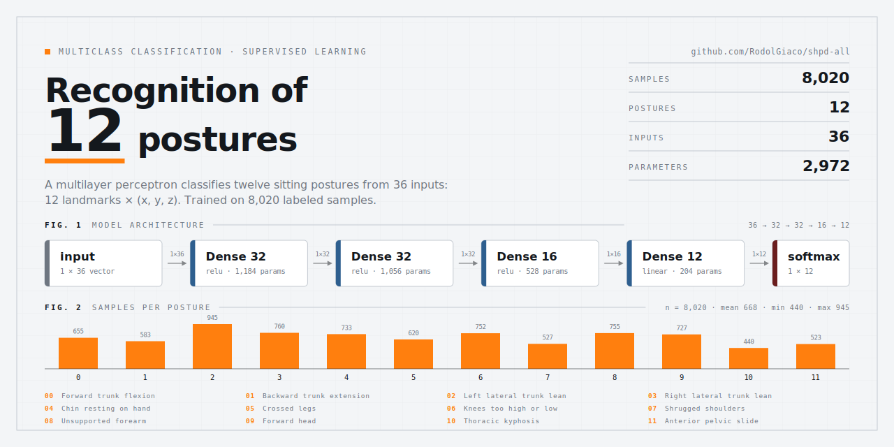

# Clasificador de postura: local (TFLite) vs. OpenAI

El backend puede resolver la clasificación fina de las 12 posturas problemáticas de dos formas intercambiables, elegidas por la variable de entorno `POSTURE_CLASSIFIER` (ver [.env.example](../.env.example)):

- **`local`** (default): un modelo propio, un multilayer perceptron entrenado y exportado a TFLite, corre directo sobre los landmarks de MediaPipe. Sin red, sin costo, sin depender de un tercero.
- **`openai`**: GPT-4o-mini (visión) sobre el frame JPEG completo. Ver `build_openai_messages` en `backend/main.py`.

Este documento cubre el mecanismo `local`, que es el que corre por default.

## Cuándo se dispara

Ambos mecanismos comparten el mismo disparador: `PostureMonitor.process_frame` (en `backend/posture_monitor.py`) cuenta cuánto tiempo seguido lleva la persona en mala postura (por ángulo de cuello/torso) y, al superar el umbral configurado (`alert_threshold:{device_id}` en Redis, ajustable desde el bot), marca `raw_frame:{session_id}` en Redis. `video_input` en `backend/main.py` lee esa marca una vez por frame y encola el trabajo según `POSTURE_CLASSIFIER`: a `api_analysis_queue` (OpenAI) o a `local_analysis_queue` (local). Los dos workers (`api_analysis_worker`, `local_analysis_worker`) arrancan siempre al iniciar el backend, pero solo uno de los dos recibe payloads en runtime.

## Pipeline paso a paso

1. **Landmarks ya calculados, sin recalcular pose.** `PostureMonitor.process_frame` ya corre MediaPipe Pose en cada frame para el cálculo de ángulos cuello/torso. Guarda ese resultado crudo (`pose_landmarks` y las dimensiones del frame) en `self.last_pose_landmarks` / `self.last_image_shape`. El clasificador local reutiliza exactamente esos landmarks — no vuelve a correr MediaPipe.

2. **Filtrado y desnormalización — `calc_landmark_list`.** De los 33 landmarks que devuelve MediaPipe Pose, se usan 12: hombros, codos, muñecas, caderas, rodillas y tobillos (torso + extremidades, índices `[11,12,13,14,15,16,23,24,25,26,27,28]`; sin landmarks de cara/cabeza). Las coordenadas `x,y` de MediaPipe vienen normalizadas 0–1; acá se desnormalizan a píxeles usando el alto/ancho del frame. `z` (profundidad relativa) se deja tal cual. Resultado: 12 puntos × 3 valores = 36 números.

3. **Normalización — `pre_process_landmark`.** Se restan las coordenadas del primer landmark del resto (invariancia a la posición absoluta de la persona en el cuadro — solo importa la pose relativa) y se escala todo por el máximo valor absoluto (invariancia a la distancia a la cámara). Salida: un vector de 36 floats en [-1, 1].

4. **Inferencia — `KeyPointClassifier.predict_proba`.** Ese vector entra al intérprete TFLite (`backend/model/keypoint_classifier.tflite`), que devuelve las 12 probabilidades crudas de su capa de salida (softmax).

5. **Mapeo a porcentaje y etiqueta canónica.** Cada probabilidad (0–1) se escala a porcentaje (0–100) y se asocia a `LOCAL_TO_CANONICAL_LABELS` — la misma redacción que usa el prompt de OpenAI para las 12 posturas. El resultado final es un `dict {postura: porcentaje}` de 12 claves, con el mismo shape exacto sin importar qué mecanismo lo generó — por eso todo lo que viene después (Redis, `PosturaCount`, timeline, alerta a Telegram) no necesita saber cuál de los dos corrió.

## El modelo

Entrenado y validado en el repo hermano **shpd-edge-vision** (ver `shpd-edge-vision/docs/RASPBERRY_PI.md`); `backend/model/keypoint_classifier.tflite` es una copia byte a byte de ese modelo (verificada por hash).

Un multilayer perceptron (MLP) — clasificación multiclase supervisada — sobre 8.020 muestras etiquetadas, repartidas de forma desigual entre las 12 posturas (entre 440 y 945 muestras por clase, promedio 668):



| Capa | Unidades | Activación | Parámetros |
|---|---|---|---|
| Input | 36 (12 landmarks × x,y,z) | — | — |
| Dense | 32 | ReLU | 1.184 |
| Dense | 32 | ReLU | 1.056 |
| Dense | 16 | ReLU | 528 |
| Dense (salida) | 12 | lineal | 204 |
| Softmax | 12 | — (op separada, no fusionada a la capa anterior) | — |

Total: 2.972 parámetros.

Verificado directamente contra el `.tflite` de `backend/model/`: las 4 capas `FULLY_CONNECTED` tienen `FusedActivationFunction` `RELU, RELU, RELU, NONE` en ese orden, y el softmax es una quinta operación (`SOFTMAX`) separada en el grafo, no una activación fusionada a la última densa.

## Requisitos de runtime

```python
try:
    from tflite_runtime.interpreter import Interpreter
except ImportError:
    from tensorflow.lite.python.interpreter import Interpreter
```

- **Raspberry Pi (ARM)**: usa `tflite_runtime`, el intérprete liviano de Google pensado para inferencia en dispositivos embebidos.
- **PC (x86_64)**: no existe wheel de `tflite_runtime` para esta arquitectura, así que cae a `tensorflow.lite`, que expone el mismo `Interpreter`. Por eso `backend/requirements.txt` y `requirements-pc.txt` incluyen `tensorflow` — es una dependencia pesada (~600 MB con TensorBoard/Keras) que solo existe para tener ese intérprete disponible en PC; en la Raspberry Pi real alcanza con `tflite_runtime`.

## Archivos involucrados

| Archivo | Rol |
|---|---|
| `backend/neural_network/pose_recognition.py` | Todo el pipeline: `KeyPointClassifier`, `calc_landmark_list`, `pre_process_landmark`, `LocalPostureClassifier` |
| `backend/model/keypoint_classifier.tflite` | El modelo entrenado |
| `backend/model/keypoint_classifier_label.csv` | Labels crudos del modelo, en el orden del softmax (solo informativo/logging — el dict de salida siempre usa `LOCAL_TO_CANONICAL_LABELS`) |
| `backend/posture_monitor.py` | Expone `last_pose_landmarks` / `last_image_shape` |
| `backend/main.py` | `local_analysis_worker`, `local_analysis_queue`, selector `POSTURE_CLASSIFIER` |

## Local vs. OpenAI

| | Local (TFLite) | OpenAI (GPT-4o-mini) |
|---|---|---|
| Entrada | landmarks numéricos (36 floats) | imagen JPEG completa |
| Red / costo por uso | no | sí (llamada a la API) |
| Latencia típica | milisegundos | ~2–3 s |
| Requiere `OPENAI_API_KEY` | no | sí |
| Requiere internet | no | sí |

Ambos alimentan exactamente el mismo camino posterior (`_apply_classification_result` en `backend/main.py`), así que se puede cambiar de uno a otro con solo tocar `POSTURE_CLASSIFIER` en `.env` y reiniciar el backend — sin tocar frontend ni bot.
